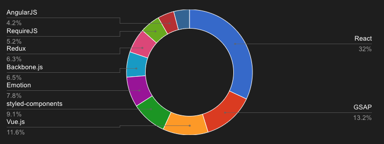

# React: A JavaScript Library

## Marketshare analysis

According to [Wappalyzer](https://www.wappalyzer.com/technologies/javascript-frameworks/), the framework/library with the highest market share is React, followed by [GSAP](https://gsap.com/)(Green Sock Animation Platform), a Javascript animation library.

## React example user

The company website that gets the most traffic and uses React is [ChatGPT](https://openai.com/chatgpt/), an artificial intelligence developer.

## Svelt example user

The website with the most traffic that uses Svelt is listed as askubuntu.com. This is not really a traditional company and is more a part of StackExchange. The list continues with several open source projects or companies with vague revenue models. The first recognizable company is [Brave](https://brave.com/).  Brave is a web browser developer.
